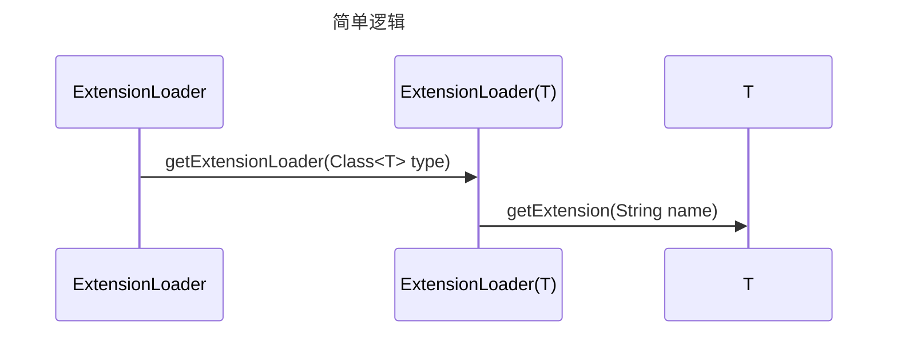
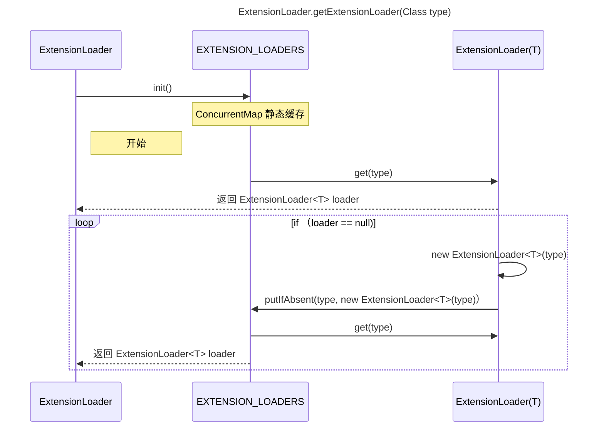

  

```java

Protocol protocol = ExtensionLoader.getExtensionLoader(Protocol.class).getExtension("myProtocol");

```



```java

public static <T> ExtensionLoader<T> getExtensionLoader(Class<T> type) {

if (type == null) {

throw new IllegalArgumentException("Extension type == null");

}

if (!type.isInterface()) {

throw new IllegalArgumentException("Extension type (" + type + ") is not an interface!");

}

if (!withExtensionAnnotation(type)) {

throw new IllegalArgumentException("Extension type (" + type +

") is not an extension, because it is NOT annotated with @" + SPI.class.getSimpleName() + "!");

}

  

ExtensionLoader<T> loader = (ExtensionLoader<T>) EXTENSION_LOADERS.get(type);

if (loader == null) {

EXTENSION_LOADERS.putIfAbsent(type, new ExtensionLoader<T>(type));

loader = (ExtensionLoader<T>) EXTENSION_LOADERS.get(type);

}

return loader;

}

```

