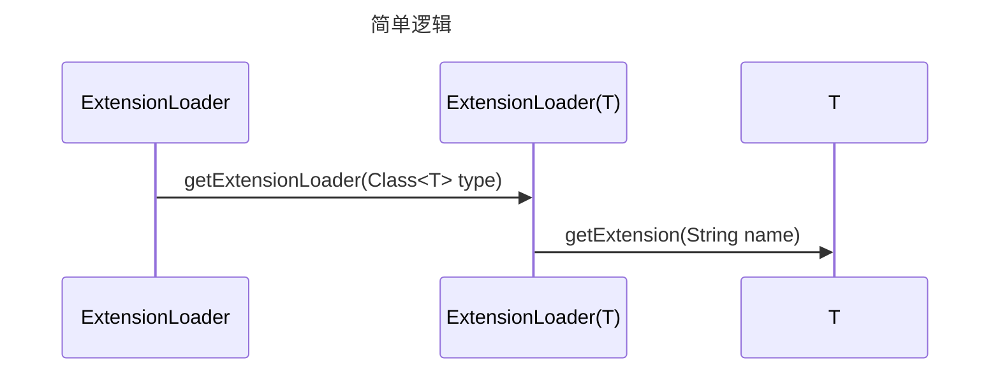
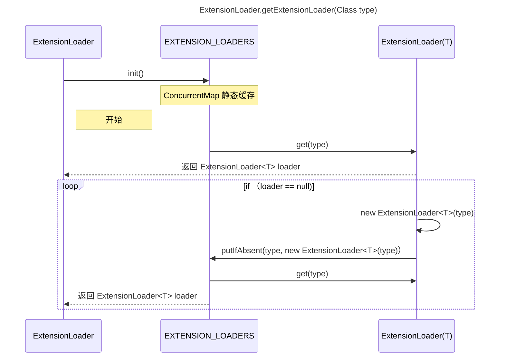

  

```java

Protocol protocol = ExtensionLoader.getExtensionLoader(Protocol.class).getExtension("myProtocol");

```



```java

public static <T> ExtensionLoader<T> getExtensionLoader(Class<T> type) {

if (type == null) {

throw new IllegalArgumentException("Extension type == null");

}

if (!type.isInterface()) {

throw new IllegalArgumentException("Extension type (" + type + ") is not an interface!");

}

if (!withExtensionAnnotation(type)) {

throw new IllegalArgumentException("Extension type (" + type +

") is not an extension, because it is NOT annotated with @" + SPI.class.getSimpleName() + "!");

}

  

ExtensionLoader<T> loader = (ExtensionLoader<T>) EXTENSION_LOADERS.get(type);

if (loader == null) {

EXTENSION_LOADERS.putIfAbsent(type, new ExtensionLoader<T>(type));

loader = (ExtensionLoader<T>) EXTENSION_LOADERS.get(type);

}

return loader;

}

```




```java
public T getExtension(String name) {
    return getExtension(name, true);
}

public T getExtension(String name, boolean wrap) {
    if (StringUtils.isEmpty(name)) {
        throw new IllegalArgumentException("Extension name == null");
    }
    if ("true".equals(name)) {
        return getDefaultExtension();
    }
    //查看缓存
    final Holder<Object> holder = getOrCreateHolder(name);
    Object instance = holder.get();
    if (instance == null) {
        synchronized (holder) {
            instance = holder.get();
            if (instance == null) {
                instance = createExtension(name, wrap);
                holder.set(instance);
            }
        }
    }
    return (T) instance;
}

private Holder<Object> getOrCreateHolder(String name) {
    Holder<Object> holder = cachedInstances.get(name);
    if (holder == null) {
        cachedInstances.putIfAbsent(name, new Holder<>());
        holder = cachedInstances.get(name);
    }
    return holder;
}
```

```java
private T createExtension(String name, boolean wrap) {
    // 加载指定目录下的所有文件
    Class<?> clazz = getExtensionClasses().get(name);
    if (clazz == null) {
        throw findException(name);
    }
    try {
        T instance = (T) EXTENSION_INSTANCES.get(clazz);
        if (instance == null) {
            EXTENSION_INSTANCES.putIfAbsent(clazz, clazz.newInstance());
            // 实现依赖注入
            instance = (T) EXTENSION_INSTANCES.get(clazz);
        }
        injectExtension(instance);
        if (wrap) {
            List<Class<?>> wrapperClassesList = new ArrayList<>();
            if (cachedWrapperClasses != null) {
                wrapperClassesList.addAll(cachedWrapperClasses);
                wrapperClassesList.sort(WrapperComparator.COMPARATOR);
                Collections.reverse(wrapperClassesList);
            }
            if (CollectionUtils.isNotEmpty(wrapperClassesList)) {
                for (Class<?> wrapperClass : wrapperClassesList) {
                    Wrapper wrapper = wrapperClass.getAnnotation(Wrapper.class);
                    if (wrapper == null
                            || (ArrayUtils.contains(wrapper.matches(), name) && !ArrayUtils.contains(wrapper.mismatches(), name))) {
                        instance = injectExtension((T) wrapperClass.getConstructor(type).newInstance(instance));
                    }
                }
            }
        }
        initExtension(instance);
        return instance;
    } catch (Throwable t) {
        throw new IllegalStateException("Extension instance (name: " + name + ", class: " +
                type + ") couldn't be instantiated: " + t.getMessage(), t);
    }
}

/**
 * 加载指定目录下的所有文件
 */
private Map<String, Class<?>> getExtensionClasses() {
    Map<String, Class<?>> classes = cachedClasses.get();
    if (classes == null) {
        synchronized (cachedClasses) {
            classes = cachedClasses.get();
            if (classes == null) {
                classes = loadExtensionClasses();
                cachedClasses.set(classes);
            }
        }
    }
    return classes;
}

private Map<String, Class<?>> loadExtensionClasses() {
    cacheDefaultExtensionName();
    Map<String, Class<?>> extensionClasses = new HashMap<>();
    for (LoadingStrategy strategy : strategies) {
        loadDirectory(extensionClasses, strategy.directory(), type.getName(), strategy.preferExtensionClassLoader(), strategy.overridden(), strategy.excludedPackages());
        loadDirectory(extensionClasses, strategy.directory(), type.getName().replace("org.apache", "com.alibaba"), strategy.preferExtensionClassLoader(), strategy.overridden(), strategy.excludedPackages());
    }
    return extensionClasses;
}

/**
 * 实现依赖注入
 */
private T injectExtension(T instance) {

    if (objectFactory == null) {
        return instance;
    }

    try {
        for (Method method : instance.getClass().getMethods()) {
            if (!isSetter(method)) {
                continue;
            }
            /**
             * Check {@link DisableInject} to see if we need auto injection for this property
             */
            if (method.getAnnotation(DisableInject.class) != null) {
                continue;
            }
            Class<?> pt = method.getParameterTypes()[0];
            if (ReflectUtils.isPrimitives(pt)) {
                continue;
            }

            try {
                String property = getSetterProperty(method);
                Object object = objectFactory.getExtension(pt, property);
                if (object != null) {
                    method.invoke(instance, object);
                }
            } catch (Exception e) {
                logger.error("Failed to inject via method " + method.getName()
                        + " of interface " + type.getName() + ": " + e.getMessage(), e);
            }

        }
    } catch (Exception e) {
        logger.error(e.getMessage(), e);
    }
    return instance;
}
```

