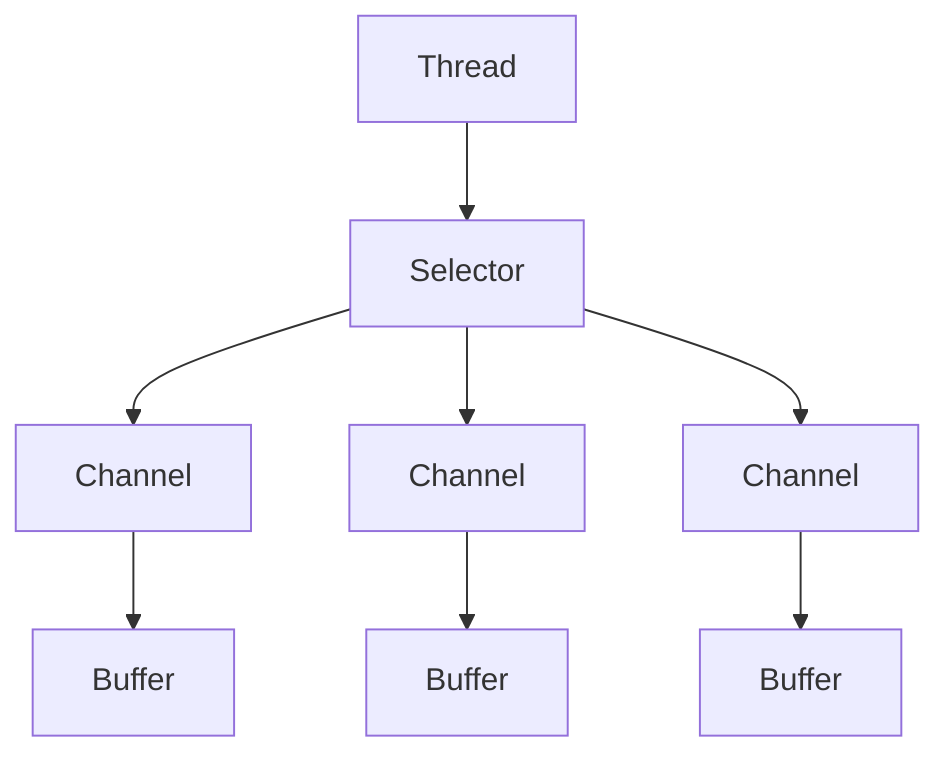

*   普通 IO ，面向流，同步阻塞线程。
*   NIO，面向缓冲区，同步非阻塞。

| 属性\模型              | 阻塞BIO | 非阻塞NIO | 异步AIO  |
| ------------------ | ----- | ------ | ------ |
| blocking           | 阻塞并同步 | 非阻塞但同步 | 非阻塞并异步 |
| 线程线（server：client） | 1:1   | 1：N    | 0：N    |
| 复杂度                | 简单    | 较复杂    | 复杂     |
| 吞吐量                | 低     | 高      | 高      |
|                    |       |        |        |

### NIO

