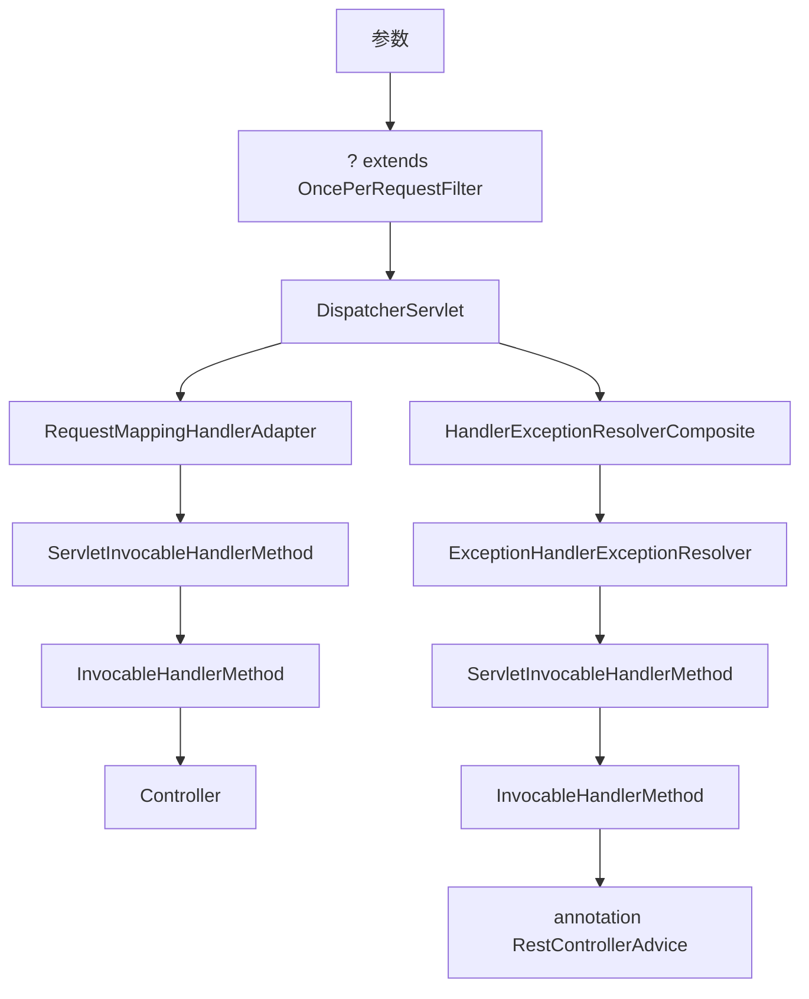

## 参数的流程

## 参数的处理
参数 -> Spring MVC -> 参数的转化 -> 参数的组装 -> 参数的校验 -> Controller

## 重点
DispatcherServlet 2.寻找处理器 3.调用处理器

## 转化
@RequestBody 的处理
@DateTimeFormat 的处理

## 组装
多个同名参数的处理
String -> String[]

## 校验
BindingResult 的处理