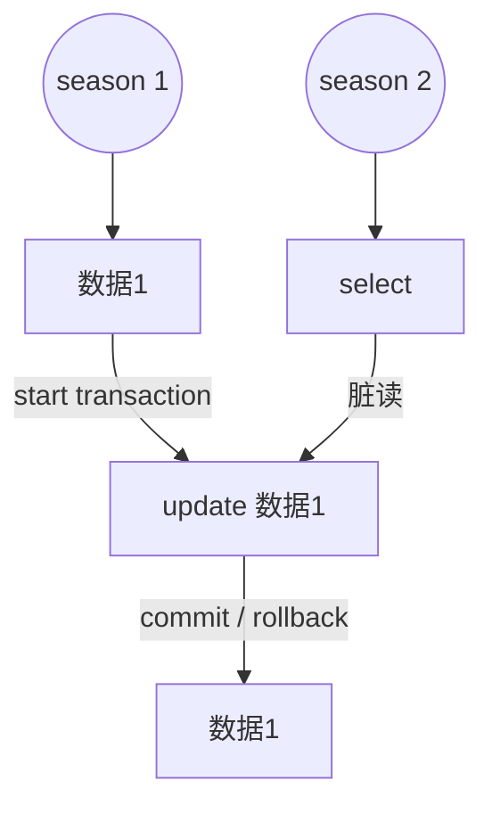
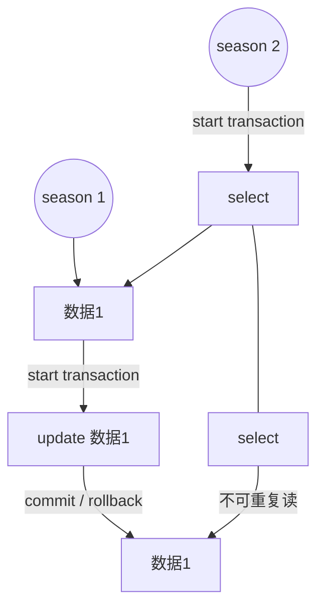
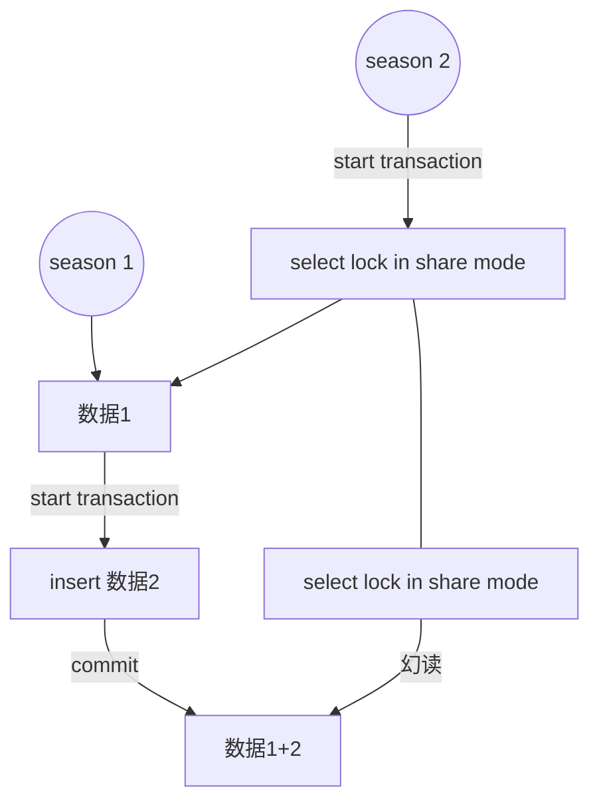

事务隔离问题是[[数据库]]的问题

### 脏读

```mermaid
graph TD
A((season 1))-->B[数据1]
B-->|start transaction|C[update 数据1]
C-->|commit / rollback|D[数据1]
a((season 2))-->b[select]
b-->|脏读|C
```

### 不可重复读

```mermaid
graph TD
A((season 1))-->B[数据1]
B-->|start transaction|C[update 数据1]
C-->|commit / rollback|D[数据1]
a((season 2))-->|start transaction|b[select]
b-->B
b---c[select]
c-->|不可重复读|D
```

### 幻读

```mermaid
graph TD
A((season 1))-->B[数据1]
B-->|start transaction|C[insert 数据2]
C-->|commit|D[数据1+2]
a((season 2))-->|start transaction|b[select lock in share mode]
b-->B
b---c[select lock in share mode]
c-->|幻读|D
```
